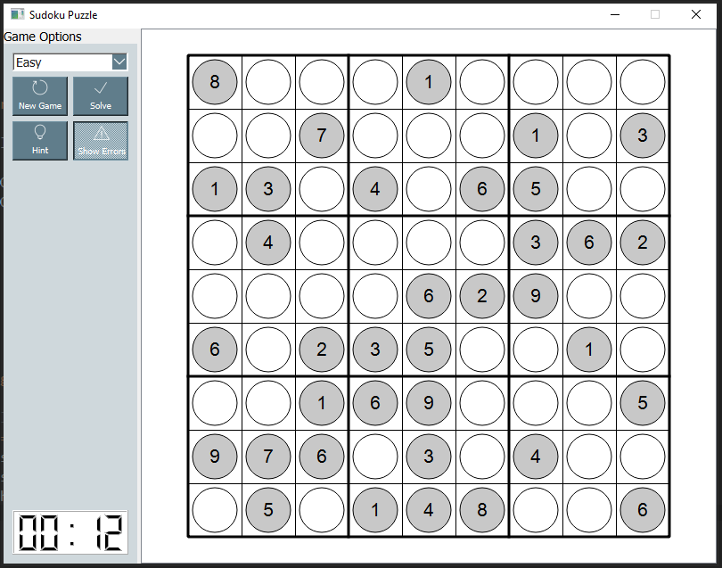
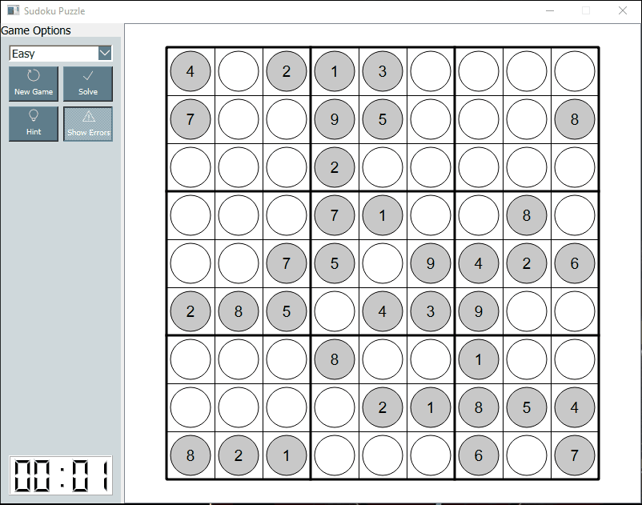

# Python Sudoku Application

Simple Sudoku game with GUI, utilizing backtracking algorithm to create games of multiple difficulties. 

### Description
----------------
This project was built with the intention of exploring backtracking algorithms and recursion. Sudoku is a classic example where recursion can be used to efficiently solve the game. Backtracking algorithms were implemented, not just for checking user input, but also for generating new Sudoku boards of differing difficulty, and verifying that they are indeed solveable.

This project was written in Python 3.7, and the GUI was written using the popular Python wrapper for Qt, PyQt5. An image of the GUI interface is shown below. 

The user is able to utilize the menu on the left side of the window to select difficulty, start a new game, solve the current board, provide hints, and also show errors. The "show errors" button is toggleable, and by default, is enabled. This notifies the user when any input is invalid based on the rules of the Sudoku game.
Additionally, there is a timer that keeps track of time spent on the current board. 

On application launch, an easy game will be initialized by default. Below is a demonstration of the basic user interface of the application. 

### Sudoku Rules 
----------------
The classic Sudoku game involves a grid of 81 squares. The grid is divided into nine blocks, each containing nine squares.

The rules of the game are simple: each of the nine blocks has to contain all the numbers 1-9 within its squares. Each number can only appear once in a row, column or box.

The difficulty lies in that each vertical nine-square column, or horizontal nine-square line across, within the larger square, must also contain the numbers 1-9, without repetition or omission.